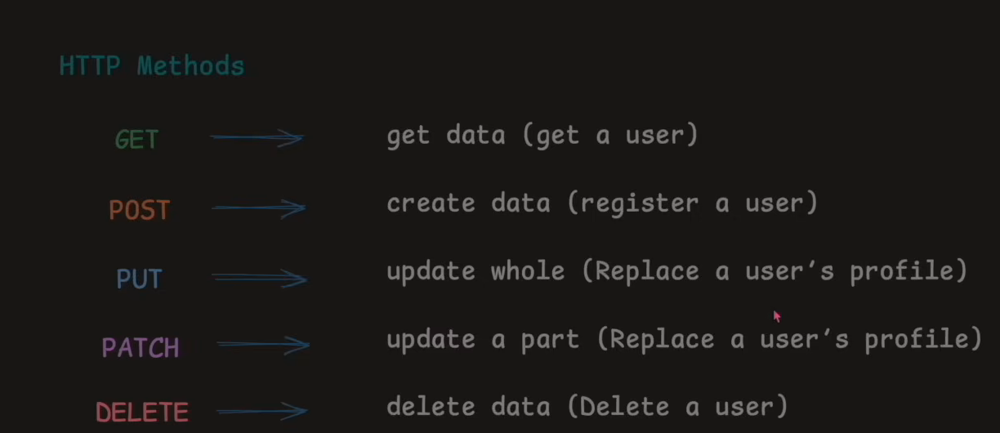
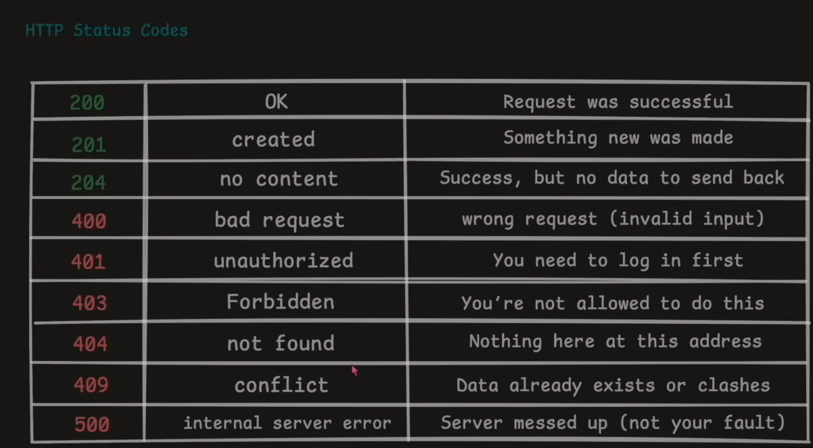

# HTTP-methods

## 1️⃣ GET — “Give me data”

**Reads data**

No changes

GET /users
GET /users/123

🧠 Real life: Open menu, just looking
---

## 2️⃣ POST — “Create something new”

**Sends data**

Creates resource

POST /users/register

🧠 Real life: Place a new order
---

## 3️⃣ PUT — “Replace entire thing”

**Updates ALL fields**

PUT /users/123

🧠 Real life: Rewrite whole form
---

## 4️⃣ PATCH — “Update part of it”

Updates SOME fields

PATCH /users/123

🧠 Real life: Change only phone number
---

## 5️⃣ DELETE — “Remove it”

Deletes resource

DELETE /users/123

🧠 Real life: Cancel order
---
<h2>Summary Table</h2>

<table>
  <tr>
    <th style="padding-right: 100px;">Method</th>
    <th style="padding-right: 100px;">Purpose</th>
    <th style="padding-right: 100px;">Changes DB</th>
  </tr>
  <tr>
    <td>GET</td>
    <td>Read data</td>
    <td>❌</td>
  </tr>
  <tr>
    <td>POST</td>
    <td>Create data</td>
    <td>✅</td>
  </tr>
  <tr>
    <td>PUT</td>
    <td>Full update</td>
    <td>✅</td>
  </tr>
  <tr>
    <td>PATCH</td>
    <td>Partial update</td>
    <td>✅</td>
  </tr>
  <tr>
    <td>DELETE</td>
    <td>Delete data</td>
    <td>✅</td>
  </tr>
</table>

